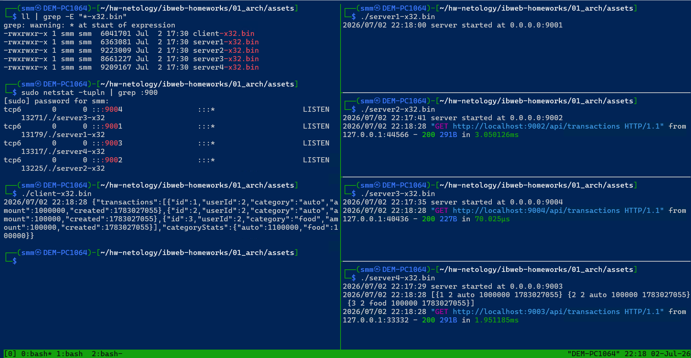
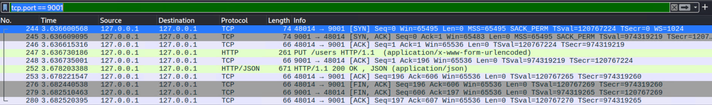
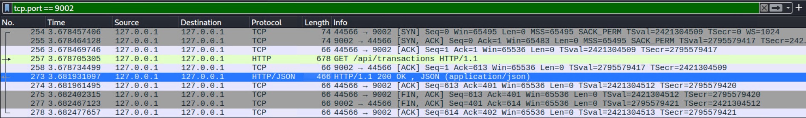
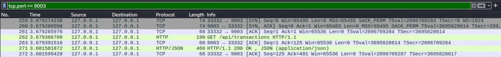
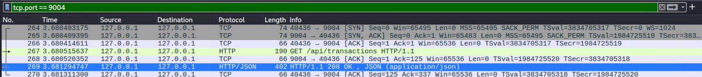

# Домашнее задание к занятию «Архитектура современных веб-сервисов»- Михалёв Сергей


## Задание «Карта взаимодействия»
Описание
Вам попало в руки приложение, состоящее из нескольких сервисов, и клиент к нему. Ваша задача — используя Wireshark, построить карту взаимодействия между сервисами в рамках запросов, которые отправляет клиент. Нужно проанализировать ответы.

<details>
<summary>Детали задания</summary>
В каталоге assets даны 4 сервера (server-1/4) под платформы:

*.bin — Linux.
*.exe — Windows.
i*.bin — macOS.
А также клиент к ним (client):

*.bin — Linux.
*.exe — Windows.
i*.bin — macOS.
Этапы выполнения
Скачайте серверы для вашей платформы. Не забудьте проверить любые скачиваемые файлы через VirusTotal.
Скачайте каталоги с ключами keys1 и keys2 и разместите их в том же каталоге, что и скачанные в п.1 серверы.
Запустите по порядку серверы от 1 до 4. Они стартуют на портах 9001–9004 соответственно.
Запустите Wireshark в режиме отслеживания loopback (Loopback: lo).
Запустите клиента, проверяя, что клиент выводит ответ в том виде, как показано ниже. Часть данных может отличаться.
{
  "transactions": [
    {
      "id": 1,
      "userId": 999,
      "category": "auto",
      "amount": 1000000,
      "created": 1613389415
    }
  ],
  "categoryStats": {
    "auto": 1000000
  }
}
Примечание. Вы не сможете скачать сами каталоги, если не умеете пользоваться Git, поэтому аккуратно скачайте файлы ключей и положите их в соответствующие каталоги, которые создаёте на своём компьютере. У вас должна получиться структура:

keys1/
public.key
private.key
keys2/
public.key
client-x64.bin (либо другой для вашей платформы)
server1-x64.bin (либо другой для вашей платформы)
server2-x64.bin (либо другой для вашей платформы)
server3-x64.bin (либо другой для вашей платформы)
server4-x64.bin (либо другой для вашей платформы)
Серверы и клиенты запускайте из командной строки.

Решение задания
В качестве решения пришлите в формате ниже ответы на вопросы:

Каким образом проходит путь запросов от клиента: на какой сервис и через какие сервисы?
Какие запросы делаются на каждом этапе, и какие ответы на них приходят?

</details>

## Решение

<details>
<summary>Подготовка стенда</summary>

Проверка файлов перед скачиванием.


Запуск серверов и клиента.


</details>

### Вывод запуска клиента:
```
{
  "transactions": [
    {
      "id": 1,
      "userId": 2,
      "category": "auto",
      "amount": 1000000,
      "created": 1783012103
    },
    {
      "id": 2,
      "userId": 2,
      "category": "auto",
      "amount": 100000,
      "created": 1783012103
    },
    {
      "id": 3,
      "userId": 2,
      "category": "food",
      "amount": 100000,
      "created": 1783012103
    }
  ],
  "categoryStats": {
    "auto": 1100000,
    "food": 100000
  }
}
```

Рассмотрим порядок работы серверов.

### 1. Client --> Server 1 
Запрос атворизации "логин-пароль". 

PUT http://localhost:9001/users</br>

    Content-Type: application/x-www-form-urlencoded
    Form item: "login" = "user"
    Form item: "password" = "111111"

Content-Type: application/json
Итогом является выдача токена:</br>

    Content-Type: application/json
    Object
      {
        "token": "<JWT>"
      }

<details>
<summary>Скриншот</summary>



</details>

### 2. Client --> Server 2
Авторизованный запрос к API с использованием ранее полученного JWT-токена.

GET http://localhost:9002/api/transactions

    User-Agent: Go-http-client/1.1

    Authorization: Bearer <JWT>

GET http://localhost:9002/api/transactions</br>

    User-Agent: Go-http-client/1.1
    Authorization: Bearer <JWT>

В ответ сервер возвращает данные в формате JSON:</br>

    Content-Type: application/json
    Object
    {
      "transactions": [
        {
          "id": 1,
          "userId": 2,
          "category": "auto",
          "amount": 1000000,
          "created": 1783027055
        },
        {
          "id": 2,
          "userId": 2,
          "category": "auto",
          "amount": 100000,
          "created": 1783027055
        },
        {
          "id": 3,
          "userId": 2,
          "category": "food",
          "amount": 100000,
          "created": 1783027055
        }
      ],
      "categoryStats": {
        "auto": 1100000,
        "food": 100000
      }
    }

<details>
<summary>Скриншот</summary>



</details>

### 3. Server 2 --> Server 3
После получения JWT клиент обращается к Server2. Далее наблюдаются обращения к Server3 и Server4, в которых вместо JWT используется внутренний заголовок X-Userid. Это позволяет сделать вывод, что проверка JWT выполняется на Server2, а взаимодействие с Server3 и Server4 осуществляется уже внутри системы между сервисами.

### 3. Server 2 --> Server 3

Внутренний запрос к сервису обработки транзакций. Вместо JWT-токена используется идентификатор пользователя, передаваемый в заголовке `X-Userid`.

GET http://localhost:9003/api/transactions</br>

    User-Agent: Go-http-client/1.1
    X-Userid: 2

В ответ сервер возвращает данные в формате JSON:</br>

    Content-Type: application/json
    Object
    {
      "transactions": [
        {
          "id": 1,
          "userId": 2,
          "category": "auto",
          "amount": 1000000,
          "created": 1783027055
        },
        {
          "id": 2,
          "userId": 2,
          "category": "auto",
          "amount": 100000,
          "created": 1783027055
        },
        {
          "id": 3,
          "userId": 2,
          "category": "food",
          "amount": 100000,
          "created": 1783027055
        }
      ],
      "categoryStats": {
        "auto": 1100000,
        "food": 100000
      }
    }

<details>
<summary>Скриншот</summary>



</details>

### 4. Server 3 --> Server 4

Внутренний запрос к сервису хранения данных. Передаётся идентификатор пользователя, после чего сервер возвращает список всех его транзакций без дополнительной обработки.

GET http://localhost:9004/api/transactions</br>

    User-Agent: Go-http-client/1.1
    X-Userid: 2

В ответ сервер возвращает список транзакций в формате JSON:</br>

    Content-Type: application/json
    [
      {
        "id": 1,
        "userId": 2,
        "category": "auto",
        "amount": 1000000,
        "created": 1783027055
      },
      {
        "id": 2,
        "userId": 2,
        "category": "auto",
        "amount": 100000,
        "created": 1783027055
      },
      {
        "id": 3,
        "userId": 2,
        "category": "food",
        "amount": 100000,
        "created": 1783027055
      }
    ]

<details>
<summary>Скриншот</summary>



</details>

### Bывод об архитектуре

* **Server 1**- сервис аутентификации (логин/пароль → JWT).
* **Server 2**- API Gateway или Backend API. Проверяет JWT и принимает запрос клиента.
* **Server 3**- бизнес-логика. Получает данные пользователя, вычисляет categoryStats и формирует итоговый ответ.
* **Server 4**- сервис данных (хранилище/репозиторий), который возвращает только список транзакций без какой-либо дополнительной обработки.
