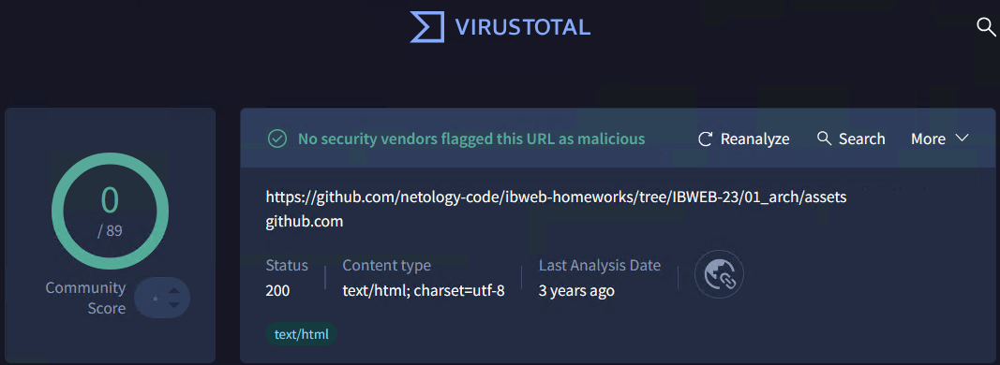

# Домашнее задание к занятию «Архитектура современных веб-сервисов»- Михалёв Сергей

## Задание «Карта взаимодействия»
Описание
Вам попало в руки приложение, состоящее из нескольких сервисов, и клиент к нему. Ваша задача — используя Wireshark, построить карту взаимодействия между сервисами в рамках запросов, которые отправляет клиент. Нужно проанализировать ответы.

Детали задания

В каталоге assets даны 4 сервера (server-1/4) под платформы:

*.bin — Linux.
*.exe — Windows.
i*.bin — macOS.
А также клиент к ним (client):

*.bin — Linux.
*.exe — Windows.
i*.bin — macOS.
Этапы выполнения
Скачайте серверы для вашей платформы. Не забудьте проверить любые скачиваемые файлы через VirusTotal.
Скачайте каталоги с ключами keys1 и keys2 и разместите их в том же каталоге, что и скачанные в п.1 серверы.
Запустите по порядку серверы от 1 до 4. Они стартуют на портах 9001–9004 соответственно.
Запустите Wireshark в режиме отслеживания loopback (Loopback: lo).
Запустите клиента, проверяя, что клиент выводит ответ в том виде, как показано ниже. Часть данных может отличаться.
{
  "transactions": [
    {
      "id": 1,
      "userId": 999,
      "category": "auto",
      "amount": 1000000,
      "created": 1613389415
    }
  ],
  "categoryStats": {
    "auto": 1000000
  }
}
Примечание. Вы не сможете скачать сами каталоги, если не умеете пользоваться Git, поэтому аккуратно скачайте файлы ключей и положите их в соответствующие каталоги, которые создаёте на своём компьютере. У вас должна получиться структура:

keys1/
public.key
private.key
keys2/
public.key
client-x64.bin (либо другой для вашей платформы)
server1-x64.bin (либо другой для вашей платформы)
server2-x64.bin (либо другой для вашей платформы)
server3-x64.bin (либо другой для вашей платформы)
server4-x64.bin (либо другой для вашей платформы)
Серверы и клиенты запускайте из командной строки.

Решение задания
В качестве решения пришлите в формате ниже ответы на вопросы:

Каким образом проходит путь запросов от клиента: на какой сервис и через какие сервисы?
Какие запросы делаются на каждом этапе, и какие ответы на них приходят?

## Решение

Проверка файлов перед скачиванием.

